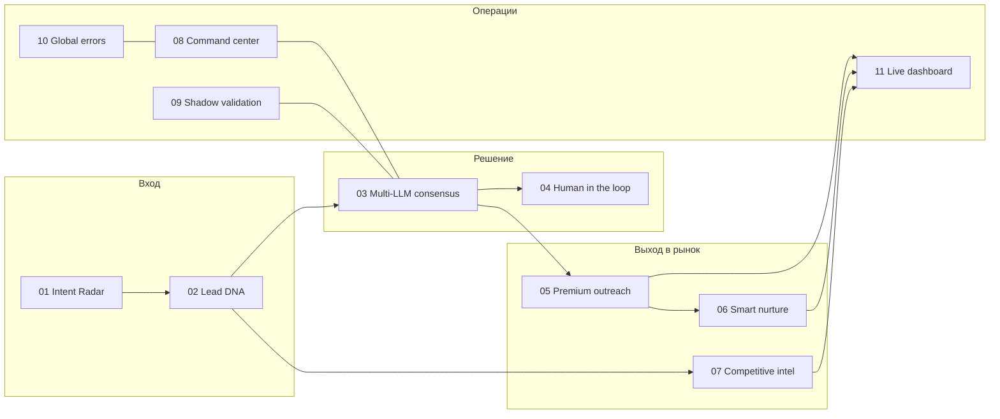

# Leadgen n8n — система лидогенерации (11 workflow)

**Проблема:** в B2B-воронке нужно не просто «слать письма», а последовательно обогащать лида, согласовывать ответы LLM, держать эскалацию человеку и видеть результат на дашборде.

**Решение:** набор из **11 связанных workflow** для **n8n** — от сканирования интента до live-dashboard, с контурами консенсуса нескольких моделей, nurture, конкурентной разведки и глобального error-handler.

**Стек:** n8n, JSON-экспорты workflow (папка [`n8n-workflows/`](./n8n-workflows/)), интеграции с LLM/данными настраиваются при импорте в ваш инстанс n8n.

**Ценность для бизнеса:** закрывается цепочка «сигнал → обогащение → решение (AI + human-in-the-loop) → коммуникация → контроль качества → отчётность».

---

## Карта workflow

Импортируйте JSON из `n8n-workflows/` в порядке или по названию; триггеры и учётные данные задаются в UI n8n.

| № | Файл | Назначение (кратко) |
|---|------|---------------------|
| 1 | `01-intent-radar.json` | Радар интента: ранние сигналы и события для входа в воронку |
| 2 | `02-lead-dna-deep-enrichment.json` | Глубокое обогащение профиля лида |
| 3 | `03-multi-llm-consensus.json` | Несколько LLM и согласование ответов |
| 4 | `04-human-in-the-loop.json` | Точки остановки и эскалация человеку |
| 5 | `05-premium-outreach-conversion-funnel.json` | Конверсионная ветка премиум-касания |
| 6 | `06-smart-nurture-warmth-decay.json` | Nurture с учётом «температуры» лида и затухания |
| 7 | `07-competitive-intelligence.json` | Конкурентная разведка в потоке |
| 8 | `08-command-center.json` | Командный центр / оркестрация |
| 9 | `09-shadow-mode-validation.json` | Shadow-режим для валидации до продакшена |
| 10 | `10-global-error-handler.json` | Единая обработка ошибок по системе |
| 11 | `11-live-results-dashboard.json` | Поток данных для live dashboard |

---

## Схема связей (логический поток)

---

## Как запустить у себя

1. Поднимите **n8n** (cloud или self-hosted).
2. Импортируйте workflow из [`n8n-workflows/`](./n8n-workflows/).
3. Настройте **учётные данные**: LLM API, CRM, почта, таблицы — по узлам в каждом JSON.
4. Включите триггеры (webhook, cron, события) в соответствии с вашей инфраструктурой.

**Чек-лист переменных (типовой):** ключи LLM, URL CRM/API, токены почты, ID таблиц/БД, webhook URL для dashboard — конкретика зависит от ваших узлов после импорта.

---

## Демо и медиа

Скриншоты схем n8n и dashboard переносите в [`media/`](./media/) (см. [`media/README.md`](./media/README.md)).

---

## Ограничения

- Экспорты — **шаблоны**: без ваших секретов и без привязки к конкретному хостингу n8n.
- Стоимость LLM и лимиты API нужно контролировать отдельно.
- Юридические аспекты рассылок и персональных данных — на стороне вашей политики и региона.
