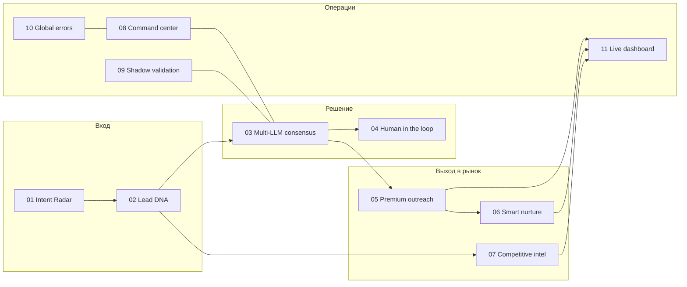

# Leadgen n8n System — 11 Workflow B2B Lead Generation

Система B2B лидогенерации из 11 связанных n8n workflow. Закрывает полную цепочку: сигнал интента → обогащение профиля → AI-решение с human-in-the-loop → персонализированное касание → nurture с затуханием → конкурентная разведка → live dashboard.

## Business Problem

В B2B-воронке недостаточно просто отправлять письма. Нужно:
- поймать сигнал интента в нужный момент
- обогатить профиль лида перед касанием
- избежать ошибок с одним LLM через консенсус нескольких
- удержать человека в контуре принятия ключевых решений
- адаптировать частоту касаний под «температуру» лида
- иметь live-дашборд состояния воронки

Ни один из этих элементов не работает в изоляции — нужна система.

## Solution

11 n8n workflow, импортируемых в порядке нумерации. Каждый JSON — шаблон без credentials: после импорта настраиваются через UI n8n.

## Workflow Map

| № | Файл | Назначение | Ключевая логика |
|---|------|-----------|-----------------|
| 1 | `01-intent-radar.json` | Радар интента | Мониторинг сигналов (новость, событие, триггер) → формирование очереди лидов |
| 2 | `02-lead-dna-deep-enrichment.json` | Обогащение профиля | Компания + персона → данные из множества источников → Lead DNA-карточка |
| 3 | `03-multi-llm-consensus.json` | Multi-LLM консенсус | Несколько LLM оценивают квалификацию лида → weighted vote → итоговое решение |
| 4 | `04-human-in-the-loop.json` | Эскалация человеку | Стоп-точки для одобрения/корректировки перед ключевыми действиями |
| 5 | `05-premium-outreach-conversion-funnel.json` | Premium outreach | Персонализированное первое касание на основе Lead DNA |
| 6 | `06-smart-nurture-warmth-decay.json` | Smart nurture | Расписание касаний с учётом «температуры» лида; затухание при отсутствии активности |
| 7 | `07-competitive-intelligence.json` | Конкурентная разведка | Автоматический мониторинг конкурентов лида → персонализация аргументации |
| 8 | `08-command-center.json` | Командный центр | Оркестрация: роутинг между workflow, state management |
| 9 | `09-shadow-mode-validation.json` | Shadow validation | A/B тестирование workflow без влияния на production лидов |
| 10 | `10-global-error-handler.json` | Глобальный error handler | Единая обработка ошибок, retry, алерты — для всей системы |
| 11 | `11-live-results-dashboard.json` | Live dashboard | Real-time поток данных для дашборда состояния воронки |

## Architecture


```mermaid
flowchart LR
  subgraph intake["Вход"]
    W1[01 Intent Radar]
    W2[02 Lead DNA]
  end
  subgraph decide["Решение"]
    W3[03 Multi-LLM consensus]
    W4[04 Human in the loop]
  end
  subgraph engage["Выход в рынок"]
    W5[05 Premium outreach]
    W6[06 Smart nurture]
    W7[07 Competitive intel]
  end
  subgraph ops["Операции"]
    W8[08 Command center]
    W9[09 Shadow validation]
    W10[10 Global errors]
    W11[11 Live dashboard]
  end

  W1 --> W2 --> W3 --> W4
  W3 --> W5 --> W6
  W2 --> W7
  W8 --- W3
  W9 --- W3
  W10 --- W8
  W5 & W6 & W7 --> W11
```

## Tech Stack

| Компонент | Технология |
|-----------|-----------|
| Orchestration | n8n (self-hosted или cloud) |
| Database | PostgreSQL (через n8n nodes) |
| LLM | OpenAI / Anthropic / другой (настраивается в credentials) |
| Infrastructure | Docker Compose (n8n + PostgreSQL) |
| Workflows | JSON exports (папка `n8n-workflows/`) |

## Business / Domain Logic

**Intent Radar (01):** не все лиды одинаково готовы. Workflow мониторит сигналы — публикация вакансий, упоминание в СМИ, технологические изменения — и формирует очередь с приоритетом.

**Lead DNA (02):** перед первым касанием собирается максимум контекста: компания (размер, стек, финансирование), персона (роль, публичные высказывания, интересы). Используется во всех downstream workflow.

**Multi-LLM Consensus (03):** одна модель может ошибиться. Три LLM независимо оценивают квалификацию лида по одинаковым критериям, результаты взвешиваются. При расхождении > порога — эскалация в Human-in-the-loop.

**Warmth Decay (06):** лид «остывает» со временем без активности. Частота касаний и интенсивность сообщений снижаются по формуле затухания. Не беспокоить холодного лида интенсивно.

**Shadow Validation (09):** перед включением нового workflow в production он работает в shadow режиме параллельно со старым. Сравнение результатов без влияния на реальных лидов.

## Quick Start

### Локальный n8n через Docker Compose

```bash
# 1. Скопировать .env.example → .env, задать пароль и N8N_ENCRYPTION_KEY
cp .env.example .env

# 2. Поднять n8n + PostgreSQL
docker compose up -d

# UI n8n: http://localhost:5678
```

### Импорт workflow

1. Открыть http://localhost:5678
2. Создать аккаунт при первом входе
3. **Workflows → Import** — импортировать JSON из `n8n-workflows/` **в порядке 01 → 11**
4. Настроить Credentials (LLM API, CRM, email, webhook)

### Необходимые credentials (типовой список)

| Тип | Назначение |
|-----|-----------|
| OpenAI / Anthropic | LLM для анализа и генерации текстов |
| HTTP Request / Webhook | входящие сигналы интента |
| SMTP / Gmail | отправка писем |
| Google Sheets / Airtable | хранение Lead DNA |
| Webhook URL | входящие данные для dashboard |

## Configuration

`.env.example`:

| Переменная | Описание |
|-----------|---------|
| `N8N_ENCRYPTION_KEY` | Ключ шифрования (≥32 символов, обязательно) |
| `POSTGRES_PASSWORD` | Пароль PostgreSQL |
| `N8N_PORT` | Порт n8n UI (по умолчанию 5678) |

## Demo / Sample Data

В `n8n-workflows/` — JSON-шаблоны без credentials. После импорта можно:

1. Открыть workflow 01 (Intent Radar)
2. В узле Webhook нажать "Listen for test event"
3. Отправить mock payload (пример в README ниже)
4. Проследить прохождение данных через цепочку

**Пример тестового payload для Webhook:**
```json
{
  "lead_id": "test-001",
  "company": "Acme Corp",
  "contact": "John Smith",
  "email": "john@acme.com",
  "signal_type": "job_posting",
  "signal_detail": "Hiring VP Sales",
  "source": "linkedin",
  "timestamp": "2026-09-07T12:00:00Z"
}
```

## Live Demo

**Live Demo:** https://kaluginvit.github.io/Portfolio/leadgen-n8n-system/

Static architecture demo — no live outreach, credentials, or external API calls.

## Screenshots

→ `docs/SCREENSHOTS_TODO.md`

## Tests

```bash
pip install -r requirements.txt
pytest tests/test_workflows.py -v
```

Тесты проверяют структуру JSON workflow: наличие обязательных полей, связность узлов, корректность trigger-типов.

## Engineering Decisions

**11 workflow вместо монолита:** каждый workflow заменяем независимо. Можно включить shadow mode только для одного этапа. Ошибка в nurture не ломает enrichment.

**Global Error Handler (10) — отдельный workflow:** ошибки из любого workflow попадают в единое место. Там — retry logic, алерты в Slack/email, логирование в PostgreSQL. Без него каждый workflow обрабатывал бы ошибки по-своему.

**Shadow Validation (09) — до production:** изменение в LLM-промпте может кардинально изменить квалификацию лидов. Shadow mode позволяет убедиться в корректности перед тем, как изменение коснётся реальных лидов.

**PostgreSQL вместо in-memory:** state лидов (температура, история касаний, Lead DNA) должен переживать перезапуски n8n и быть доступен из всех workflow одновременно.

## Security

- Credentials хранятся только в n8n (зашифрованы `N8N_ENCRYPTION_KEY`)
- JSON workflow не содержат API ключей или токенов — только шаблоны
- `.env` не коммитится (`.gitignore`)

## Reuse / Customization

Тип: **Reusable template**

**Для адаптации под конкретный бизнес:**
1. В workflow 01: заменить источники сигналов интента (LinkedIn, CRM, custom webhook)
2. В workflow 02: настроить источники обогащения (Apollo, Clearbit, свой API)
3. В workflow 03: выбрать LLM-провайдеров и критерии квалификации
4. В workflow 05: подключить email или messenger
5. Остальные workflow работают с теми же данными без изменений

## Limitations

- Workflow — шаблоны без production credentials: нужна настройка под конкретную инфраструктуру
- Стоимость LLM-вызовов зависит от объёма воронки — нужен мониторинг расходов
- Shadow validation требует дублирования обработки: временно удваивает нагрузку на LLM

## Roadmap

- Scoring dashboard с метриками качества квалификации
- Интеграция с CRM (HubSpot, Salesforce) через нативные n8n nodes
- Автоматический A/B тест промптов с выбором лучшей версии
