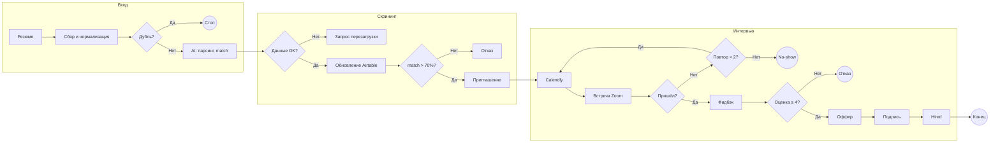

# BPMN-схемы кейсов автоматизации

> **Проблема:** при описании сложных n8n-workflow заказчику тяжело передать логику процесса — n8n-канвас не читается без контекста, а скриншоты быстро устаревают.  
> **Решение:** пара BPMN 2.0-диаграмм для двух кейсов (студия Telegram-ботов «под ключ» + IT-рекрутинг за 24 часа) + утилиты конвертации `BPMN → draw.io / Mermaid` + локальный viewer для презентации.  
> **Стек:** BPMN 2.0, draw.io / diagrams.net, Mermaid, Python (скрипты конвертации).  
> **Ценность:** готовый шаблон документации процессов для пресейла и сдачи проектов; диаграммы открываются и в Camunda Modeler, и в diagrams.net, и прямо в Markdown.

---

В этой папке лежат две BPMN 2.0-диаграммы по описанным кейсам.

## Файлы

| Файл | Описание |
|------|----------|
| **case1-telegram-bot-studio.bpmn** | Кейс 1: автоматизация студии по разработке Telegram-ботов (от заявки до готового продукта через ИИ и онлайн-оплату). |
| **case2-it-recruiting.bpmn** | Кейс 2: автоматизация рекрутинга в IT-компании (от резюме до оффера за 24 часа). |
| **viewer.html** | Просмотр обеих диаграмм в браузере (нужен локальный HTTP-сервер). |
| **case1-telegram-bot-studio.drawio** | Кейс 1 в формате draw.io (создаётся скриптом). |
| **case2-it-recruiting.drawio** | Кейс 2 в формате draw.io (создаётся скриптом). |
| **case1-telegram-bot-studio.mmd** / **case2-it-recruiting.mmd** | Код Mermaid для вставки в draw.io (Arrange → Insert → Advanced → Mermaid). |
| **bpmn_to_drawio.py** | Скрипт конвертации BPMN → draw.io. |
| **add_bpmn_edges.py** | Добавляет в диаграмму визуальные связи (BPMNEdge с waypoints) по существующим sequenceFlow. |

## Как открыть

### Вариант 1: Онлайн-редактор BPMN
- Загрузите нужный файл `.bpmn` на [bpmn.io](https://bpmn.io) (Demo) или в [Camunda Modeler](https://camunda.com/download/modeler/).

### Вариант 2: Просмотрщик в папке
1. В папке `BPMN` запустите локальный сервер, например:
   ```bash
   python -m http.server 8080
   ```
2. Откройте в браузере: `http://localhost:8080/viewer.html`.
3. Переключайте вкладки «Кейс 1» и «Кейс 2» для просмотра диаграмм.

### Mermaid в Markdown (GitHub / Cursor)

Файлы `*.mmd` можно вставить в любой `.md` обёрткой:

````markdown
```mermaid
<!-- содержимое case1-telegram-bot-studio.mmd -->
```
````

GitHub отрисует блок `mermaid` прямо в превью README или в Issues/PR.

### Вариант 3: Редакторы
- **Camunda Modeler** — бесплатный десктопный редактор BPMN.
- **bpmn.io** — веб-демо для просмотра и редактирования.

### Вариант 4: draw.io (diagrams.net)

**Способ A — готовые .drawio файлы (рекомендуется)**  
1. Сгенерируйте файлы draw.io из BPMN:
   ```bash
   python bpmn_to_drawio.py
   ```
   Появятся файлы `case1-telegram-bot-studio.drawio` и `case2-it-recruiting.drawio`.  
2. Откройте любой из них в [app.diagrams.net](https://app.diagrams.net) или в десктопном draw.io: **File → Open** и выберите `.drawio`.  
3. При необходимости смените фигуры на стили из панели **BPMN** (правый край экрана): события — круги, шлюзы — ромбы, задачи — прямоугольники.

**Способ B — вставка из Mermaid**  
1. В [app.diagrams.net](https://app.diagrams.net): **Arrange → Insert → Advanced → Mermaid**.  
2. Вставьте содержимое файла `case1-telegram-bot-studio.mmd` или `case2-it-recruiting.mmd` и нажмите **Insert**.  
3. Диаграмма появится как flowchart; при желании доработайте оформление.

**Способ C — онлайн-конвертер**  
Загрузите файл `.bpmn` на сайт [BPMN to Draw.io Converter](https://businesstools.hopto.org/) (или аналог), скачайте результат в формате draw.io и откройте его в diagrams.net.

## Краткое содержание процессов

### Кейс 1 — Студия Telegram-ботов
- **Старт:** клиент нажимает /start в боте-заказчике.
- **Этапы:** сбор брифа → уточнение через AI → запись в CRM (черновик) → расчёт стоимости и ссылка на оплату (ЮKassa) → после оплаты: генерация кода и контента (OpenAI/Codex), деплой тестового бота → клиент принимает работу → закрытие проекта (акт, инструкция).

### Кейс 2 — Рекрутинг IT
- **Старт:** поступление резюме (email, Telegram, форма, hh.ru).
- **Этапы:** сбор и нормализация → проверка на дубли → AI-парсинг и match_score → приглашение на интервью или отказ → выбор времени (Calendly) → встреча (Zoom) → сбор фидбэка → при одобрении: генерация оффера и подпись → статус Hired.

Оба процесса содержат шлюзы (исключающие ветвления) для обработки ошибок, повторов и альтернативных исходов.

---

## Упрощённые схемы (Mermaid)

Ниже — схематичное отображение процессов для просмотра в Markdown (GitHub, VS Code и т.д.).

### Кейс 1: Студия Telegram-ботов

```mermaid
flowchart LR
    subgraph Онбординг
        A[/start] --> B[Сбор брифа]
        B --> C[AI уточнение]
        C --> D{Бриф полный?}
        D -->|Нет| E{Переспрос < 3?}
        E -->|Да| B
        E -->|Нет| F[Менеджер]
        D -->|Да| G[CRM черновик]
        F --> G
    end
    subgraph Оплата
        G --> H[Рассчитать]
        H --> I[ЮKassa ссылка]
        I --> J{Оплата?}
        J -->|Нет| I
        J -->|Да| K[CRM оплачено]
    end
    subgraph ИИ и деплой
        K --> L[GPT: контент]
        L --> M[Codex: код]
        M --> N[Деплой]
        N --> O{OK?}
        O -->|Да| P[Тест бот клиенту]
        O -->|Нет| Q[Алерт]
        P --> R[Принимаю]
        R --> S[Закрытие]
    end
    S --> T((Конец))
```

### Кейс 2: Рекрутинг IT


