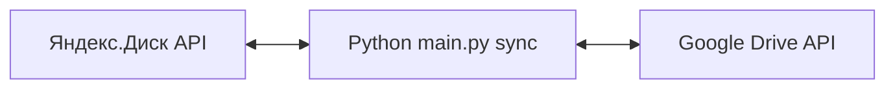

# ИзЯндексаВГугл — двусторонняя синхронизация Яндекс.Диск ↔ Google Drive

**Проблема:** файлы разъехались между Яндекс.Диском и Google Drive; ручное копирование не масштабируется, нужен предсказуемый sync с учётом конфликтов.

**Решение:** Python-сервис синхронизации с OAuth к обоим облакам, политиками конфликтов и возможностью периодического запуска (Планировщик / cron).

**Стек:** Python 3.11+, REST API Диска и Drive, токены в `.sync_state/` (не коммитить), конфиг через `.env` (шаблон — [`.env.example`](.env.example)).

**Ценность:** один проход `sync` поддерживает зеркало папок для бэкапа, миграции или гибридного workflow (офис на Google, архив на Яндексе).



Зависимости: `pip install -r requirements.txt`.

Первичный OAuth выполняется **на вашей машине** (браузер). Упаковка только в Docker без интерактива для выдачи токенов не подходит — используйте локальный запуск ниже.

## Настройка

1. Скопируйте [`.env.example`](.env.example) в `.env` и заполните переменные.
2. **Яндекс**: в кабинете OAuth есть только **Client ID**, **Secret** и зафиксированный **Redirect URL** — готового JSON Яндекс не выдаёт; файл `yandex_token.json` появится у вас **после** обмена кода на токены.
   - Если Redirect URL в приложении — **`https://oauth.yandex.ru/verification_code`** (или другой **не** localhost): в `.env` укажите ту же строку в `YANDEX_REDIRECT_URI`, затем:
     ```bash
     python main.py yandex-login --print-url
     ```
     Откройте выведенную ссылку в браузере, войдите, **скопируйте код** со страницы и выполните:
     ```bash
     python main.py yandex-login --code ВСТАВИТЬ_КОД
     ```
     Токены сохранятся в `.sync_state/yandex_token.json` (или в `YANDEX_TOKEN_PATH`).
   - Если в приложении разрешён redirect **`http://127.0.0.1:8899/`**, в `.env` задайте его же и выполните `python main.py yandex-login --port 8899` — откроется локальный приём кода.
3. **Google** — один из вариантов:
   - **Два разных JSON от Google:** (а) **учётные данные клиента** — блок `installed` / `web` из Cloud Console (часто ошибочно сохраняют как `google_token.json`); (б) **пользовательский токен** после входа в браузере — поля `token`, `refresh_token`, `client_id`, `client_secret` и т.д. Скрипт сам распознаёт (а) и при первом `sync` или `python test_folder_access.py` откроет браузер, после чего сохранит нормальный токен в **`.sync_state/google_token.json`**.
   - **Сервисный аккаунт**: `GOOGLE_SERVICE_ACCOUNT_JSON`; расшарьте папку на email сервисного аккаунта.
   - **OAuth через Desktop-приложение в Cloud Console**: `GOOGLE_OAUTH_CLIENT_SECRETS`; при первом `sync` откроется браузер, токен попадёт в `SYNC_STATE_DIR/google_token.json`.
4. Укажите `YANDEX_SYNC_PATH` (папка на Диске, например `/sync`) и `GOOGLE_SYNC_FOLDER_ID` (ID папки из URL Drive).

## Запуск

```bash
python main.py sync
```

В Windows можно запускать **`run-sync.bat`** из каталога проекта (двойной щелчок или `.\run-sync.bat` в PowerShell).

Проверка доступа к папкам: `python test_folder_access.py`. Нужен Python в `PATH`; удобно задать `PYTHONUNBUFFERED=1` для пошагового вывода в консоли Windows.

Политика конфликтов: `SYNC_CONFLICT_POLICY=lww|branch|manual`. Удаления: `SYNC_DELETIONS=1` (осторожно). Ускорение передачи: **`SYNC_PARALLEL_WORKERS=4`** (или 8) — несколько файлов качаются/заливаются параллельно (осторожнее с лимитами API). По умолчанию `1`.

## Периодический запуск

- **Windows:** Планировщик заданий → действие: программа — полный путь к `python.exe`, аргументы `main.py sync`, рабочая папка — каталог проекта. Учётная запись должна иметь доступ к `.env` и `.sync_state`.
- **Linux/macOS (cron):** например  
  `*/15 * * * * cd /path/to/ИзЯндексаВГугл && /path/to/python main.py sync >> /var/log/yandex-gdrive-sync.log 2>&1`  
  Один проход обновляет курсор изменений Drive и обходит деревья на обеих сторонах; при 429/5xx от Google в клиенте есть повторные попытки.

### Ошибка `invalid_scope` (Яндекс)

1. В [консоли OAuth](https://oauth.yandex.ru/) у приложения должны быть включены **Яндекс.Диск REST API** и нужные операции (чтение / запись).
2. В коде по умолчанию запрашиваются **два** scope под две галочки в консоли:  
   `cloud_api:disk.read cloud_api:disk.write` (пробел между ними). Старое одно значение `cloud_api:disk.read_write` у части приложений больше не сопоставляется с правами — из‑за этого и бывает `invalid_scope`.
3. Если ошибка остаётся, в `.env` добавьте **`YANDEX_OAUTH_USE_RU=1`** — будут использоваться эндпоинты `https://oauth.yandex.ru/authorize` и `https://oauth.yandex.ru/token` вместо `oauth.yandex.com`.
4. Снова `python main.py yandex-login --print-url` и новый вход в браузере (лучше в окне инкогнито).

Явные URL при необходимости: `YANDEX_OAUTH_AUTHORIZE_URL`, `YANDEX_OAUTH_TOKEN_URL`. Подробнее про OAuth: [OAuth для Яндекс ID](https://yandex.ru/dev/id/doc/ru/), про Диск: [REST API Диска](https://yandex.ru/dev/disk/rest/).
