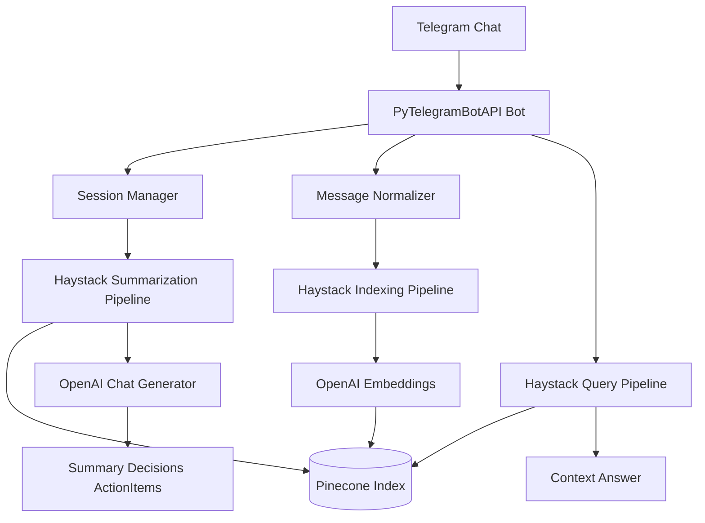

# Team AI Bot

**Проблема:** в групповом чате теряется контекст; нужно фиксировать обсуждение, спрашивать по нему и получать итоговое резюме.

**Решение:** Telegram-бот для командного чата: **сессия записи** → индексация сообщений в **Pinecone** через **Haystack** → вопросы по контексту и **summary** после остановки.

**Стек:** Python, PyTelegramBotAPI, Haystack, OpenAI-совместимые эмбеддинги/чат, Pinecone, SQLite для состояния.

## Возможности

- `/start_listening` — начать запись обсуждения.
- `/stop_listening` — остановить запись и получить summary.
- `/status` — проверить активную сессию и количество сообщений.
- `/ask <вопрос>` — задать вопрос по сохраненному контексту.
- Упоминание `@bot_username Что думаешь?` — ответ по контексту группы.
- SQLite хранит локальное состояние сессий и сообщений.
- Pinecone хранит embedding-документы с metadata по чату, автору и сессии.

## Архитектура

Архитектура сохранена в `architecture.png`.



## Подготовка Telegram

1. Создайте бота через BotFather и получите `TELEGRAM_BOT_TOKEN`.
2. Добавьте бота в Telegram-группу.
3. Через BotFather отключите Privacy Mode: `Bot Settings` -> `Group Privacy` -> `Turn off`.
4. Это обязательно, иначе бот не увидит обычные сообщения группы.

## Подготовка Pinecone

Используется `text-embedding-3-large`, поэтому Pinecone index должен иметь dimension `3072`.

Можно создать index заранее в Pinecone Console:

- type: dense vector index;
- dimension: `3072`;
- metric: `cosine`;
- cloud/region: например `aws/us-east-1`;
- name: значение `PINECONE_INDEX_NAME`.

Если index отсутствует, Haystack `PineconeDocumentStore` попробует создать его с параметрами из `.env`.

## Настройка окружения

Скопируйте `.env.example` в `.env` и заполните значения:

```env
TELEGRAM_BOT_TOKEN=
OPENAI_API_KEY=
OPENAI_BASE_URL=https://api.proxyapi.ru/openai/v1
OPENAI_MODEL=gpt-4o-mini
EMBEDDING_MODEL=text-embedding-3-large
PINECONE_API_KEY=
PINECONE_INDEX_NAME=team-ai-bot
PINECONE_NAMESPACE=telegram-team-chat
PINECONE_INDEX_DIMENSION=3072
```

Реальный `.env` не коммитится.

## Установка и запуск (локально)

```bash
python -m venv .venv
.venv\Scripts\activate
pip install -r requirements.txt
python bot.py
```

## Деплой (Docker)

1. Скопируйте `.env.example` → `.env`, заполните переменные (см. выше).
2. Из каталога проекта:

```bash
docker compose up -d --build
```

Остановка: `docker compose down`. Образ использует `Dockerfile`, точка входа — `bot.py`. Файл `.env` не должен попадать в git.

## Демо-сценарий для оценки

1. Запустите `python bot.py`.
2. В Telegram-группе отправьте `/help`.
3. Отправьте `/start_listening`.
4. Напишите 8-12 сообщений от двух участников на рабочую тему.
5. Спросите `/ask Какие аргументы были за вариант A и вариант B?`.
6. Упомяните бота: `@bot_username Что думаешь?`.
7. Отправьте `/stop_listening`.
8. Получите итог с резюме, позициями, решениями, action items и открытыми вопросами.

## Материалы для портфолио (по желанию)

- Скрин команды с работающим ботом и итогового summary.
- Скрин Pinecone index/namespace (без секретов).
- Ссылка на этот репозиторий в составе портфолио.

## Проверки

Локальные проверки без реальных API:

```bash
python -m compileall bot.py src tests
python -m pytest
```

Интеграционная проверка требует заполненный `.env`, Telegram-группу, OpenAI/proxyapi.ru и Pinecone.

## Ограничения

- Нужны активные API-ключи и платный/лимитированный трафик LLM и Pinecone.
- В группе должен быть отключён group privacy у бота (см. выше).
- Размер контекста и стоимость растут с длиной сессии — для продакшена задайте лимиты в коде/политике.
