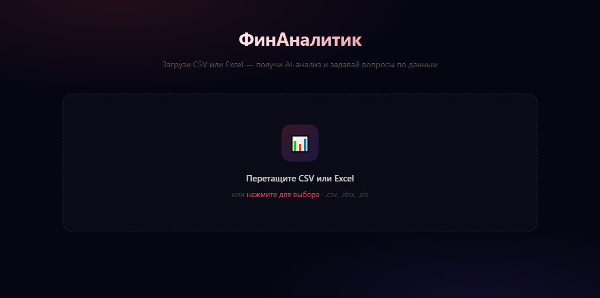
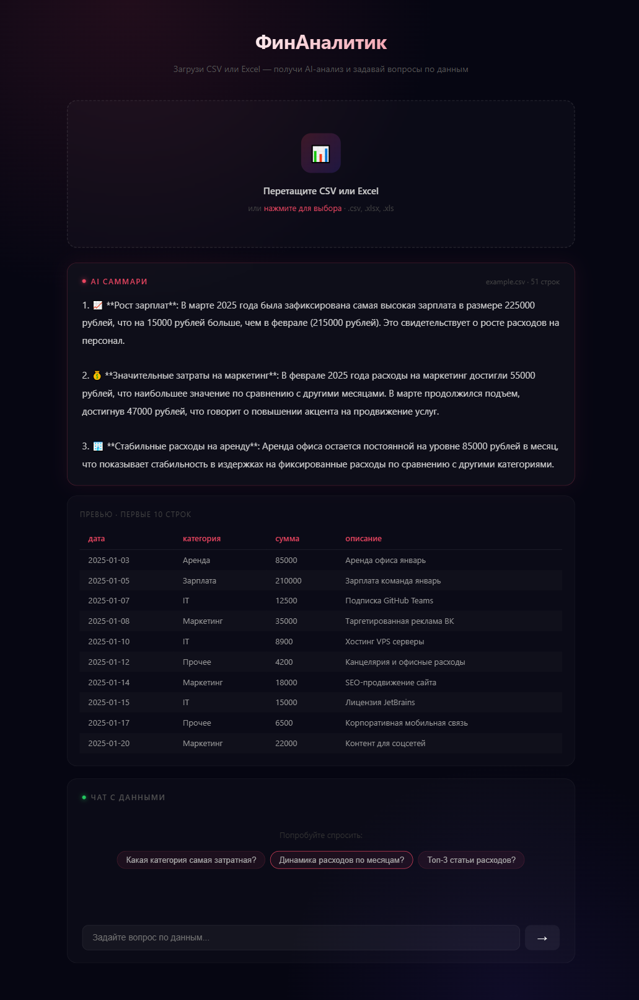
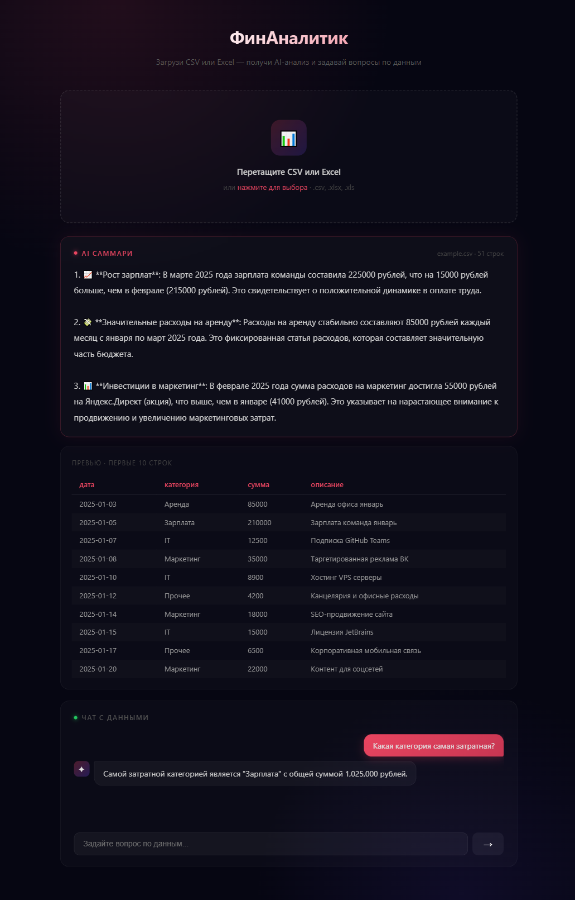

# ФинАналитик (finsight)

AI-аналитик финансовых таблиц: загрузи CSV или Excel — получи топ-3 инсайта и задавай вопросы по данным на русском языке.

## Проблема

Финансовый аналитик или предприниматель открывает выгрузку из 1С / банка / CRM — сотни строк, десятки колонок. Чтобы понять "где просадка" или "что растёт", нужно 30–60 минут ручной работы: фильтры, сводные, поиск аномалий.

## Решение

Загружаешь файл — AI сразу выдаёт три ключевых инсайта с конкретными числами. Дальше можно задавать вопросы в свободной форме: "Какой месяц был убыточным?", "Сравни Q1 и Q2", "Где самые большие расходы?". Ответ — за секунды, со ссылками на реальные цифры из таблицы.

**Результат:** первый анализ за 30 секунд вместо часа ручной работы.

## Скриншоты





## Быстрый старт

```bash
# 1. Клонировать репозиторий
git clone https://github.com/kaluginvit/finsight.git
cd finsight

# 2. Создать .env файл
cp .env.example .env
# Вставить API ключ в .env (ANTHROPIC_API_KEY)

# 3. Запустить
docker-compose up --build
```

Открыть в браузере: http://localhost:3000

> Деплой на сервер пока не настроен. Работает локально через docker-compose.

## Как пользоваться

1. Загрузите CSV или Excel файл (drag & drop или кнопка)
2. Получите автоматическое AI-саммари: топ-3 инсайта с цифрами
3. Задавайте вопросы в чате — модель работает строго с данными файла

**Тестовый файл:** `data/example.csv` — расходы компании за январь–март 2025.

## Почему этот стек

| Технология | Причина выбора |
|---|---|
| **FastAPI** | Async file upload из коробки, Pydantic-валидация без бойлерплейта, автодока /docs бесплатно |
| **React + Vite** | Интерактивный чат без перезагрузки страницы, HMR ускоряет итерации при разработке |
| **GPT-4o-mini через ProxyAPI** | Хорошо понимает финансовый контекст и табличные данные, доступен через российский прокси |
| **pandas** | Надёжный парсинг CSV/Excel с типами, конвертация в markdown-таблицу для промпта |
| **Docker** | Воспроизводимая среда, один `docker-compose up` для всего стека |

## Структура проекта

```
finsight/
├── backend/
│   ├── main.py              # FastAPI: /upload, /chat, /health
│   ├── claude_client.py     # OpenAI-совместимый клиент (ProxyAPI), промпты
│   ├── file_parser.py       # pandas: CSV/Excel → markdown-таблица для модели
│   ├── requirements.txt     # prod зависимости
│   ├── requirements-dev.txt # + pytest, httpx для тестов
│   └── tests/
│       └── test_api.py      # smoke tests: валидация входных данных
├── frontend/
│   └── src/
│       ├── App.jsx
│       ├── FileUpload.jsx
│       ├── Chat.jsx
│       └── Summary.jsx
├── data/
│   └── example.csv
├── docs/
│   └── screenshots/
└── docker-compose.yml
```

## Запуск тестов

```bash
cd backend
pip install -r requirements-dev.txt
pytest tests/ -v
```

## Переменные окружения

| Переменная | Обязательная | Описание |
|---|---|---|
| `ANTHROPIC_API_KEY` | Да | API ключ (ProxyAPI или OpenAI) |
| `ANTHROPIC_BASE_URL` | Нет | Base URL прокси (по умолчанию proxyapi.ru) |
| `LLM_MODEL` | Нет | Модель (по умолчанию `gpt-4o-mini`) |
