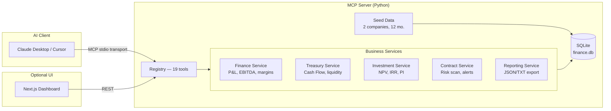
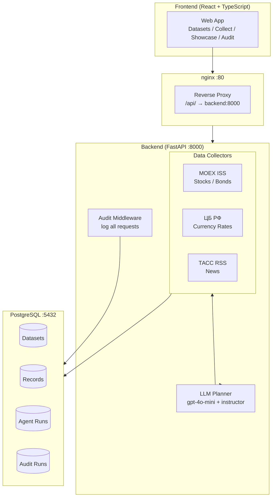
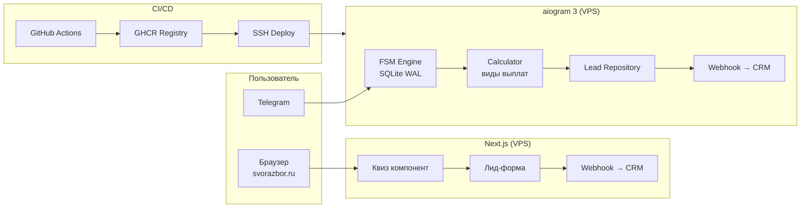
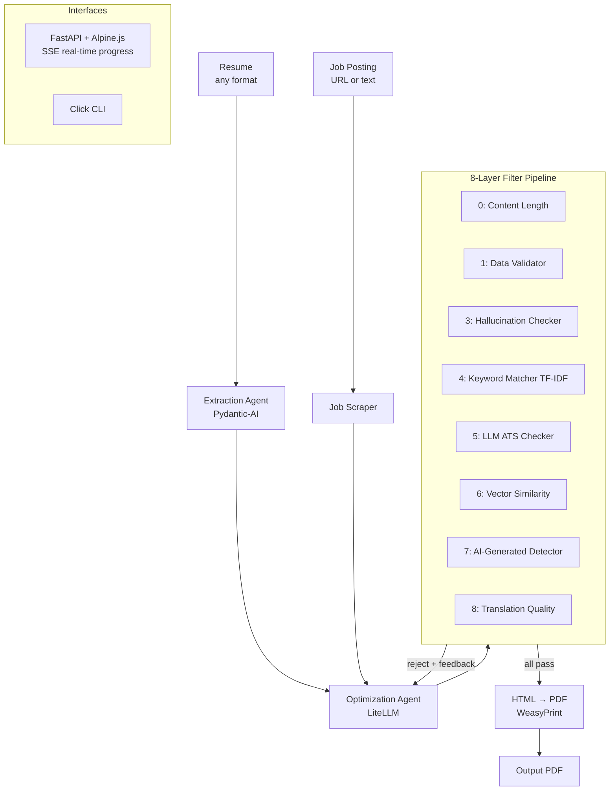
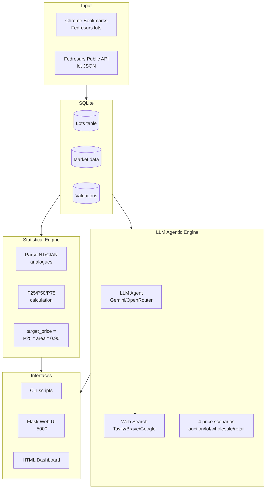
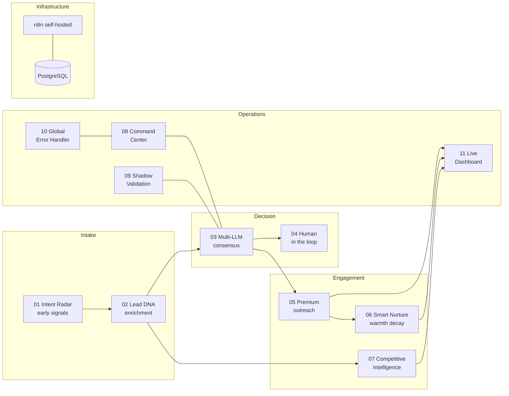
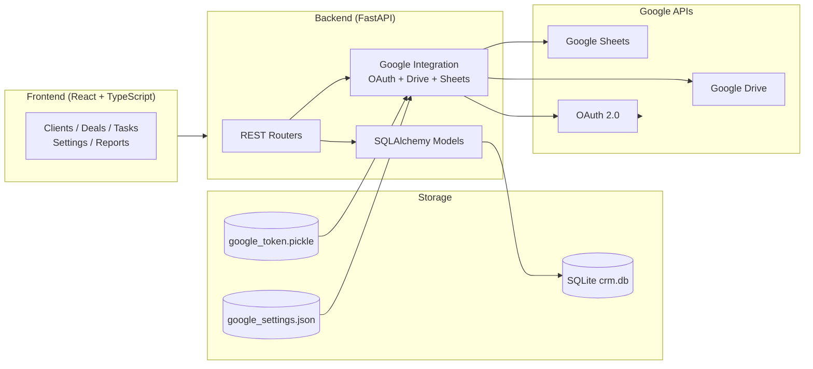
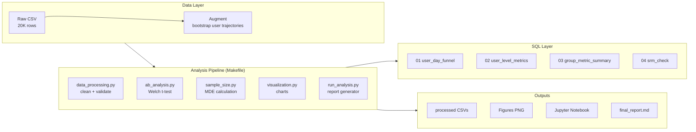
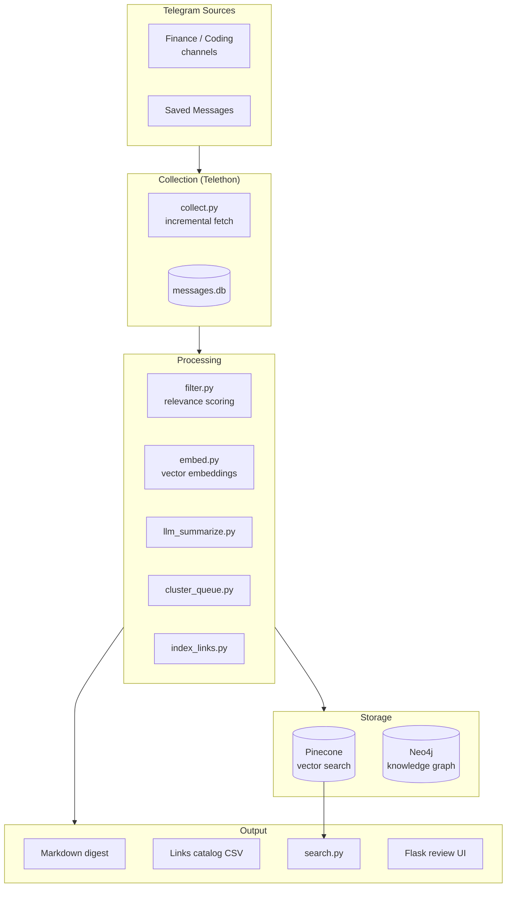

# Portfolio Architecture Map

> Архитектурные схемы showcase-проектов

---

## 1. finance-mcp-server

**Corporate Finance AI Layer — MCP Protocol**

**Ключевые решения:**
- SQLite zero-deploy: данные не уходят за пределы машины
- Registry pattern: вызов tools без MCP-транспорта (для тестов)
- 19 tools → 6 сервисов → 1 БД-коннектор

---

## 2. finance-data-screener

**AI Financial Data Screener — Full Stack**

---

## 3. svo-payments-bot + svo-payouts-website

**Связная система: Web + Telegram**

---

## 4. hr-breaker

**Resume Optimizer — Multi-Agent Pipeline**

---

## 5. rf-macro-risk-ai

**Macro Risk AI — Scoring Pipeline**

```mermaid
flowchart LR
    subgraph criteria["35 Criteria"]
        FAST[Fast react\n~10 criteria]
        MED[Medium react\n~15 criteria]
        SLOW[Slow react\n~10 criteria]
    end
    subgraph agent["LangChain Agent"]
        SEARCH[Tavily Web Search]
        LLM[LLM\nOpenAI/Gemini/GigaChat]
        LEDGER[Research Ledger\nlocal cache]
    end
    subgraph scoring["Scoring Engine"]
        SCORE[Weighted Sum\n0-100+]
        THRESH[Threshold\n🟢/🟡/🟠/🔴/⚫]
        DEP[Deposit Access Risk\n5 special criteria]
    end
    subgraph output["Output"]
        JSON[docs/data.json]
        HTML[GitHub Pages\ndashboard]
        TG[Telegram Channel\npost via reporter]
    end

    criteria --> agent
    agent --> scoring
    scoring --> output
```

---

## 6. fedresurs-mvp

**Bankruptcy Lot Valuation — Dual Engine**

---

## 7. leadgen-n8n-system

**B2B Lead Generation — 11 Workflow System**

---

## 8. mini-crm-fastapi-react

**CRM + Google Integration — Full Stack**

---

## 9. fintech-ab-test-credit-offer

**A/B Test Analytics Pipeline**

---

## 10. tg-digest-pipeline (TIER B)

**Personal Knowledge Extraction Pipeline**

