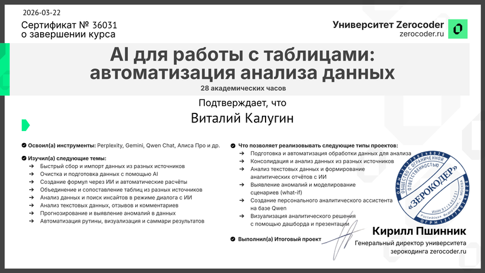
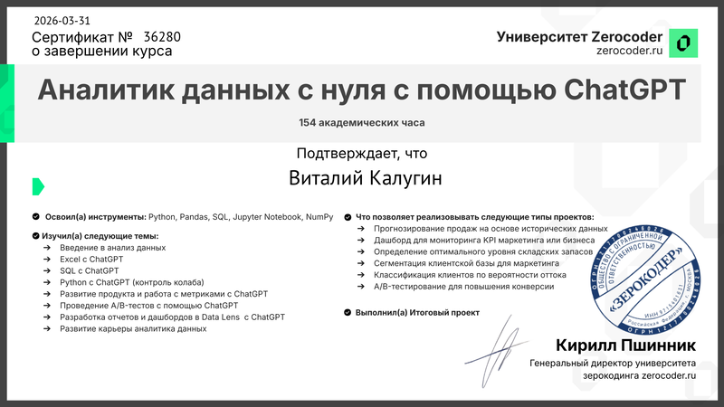
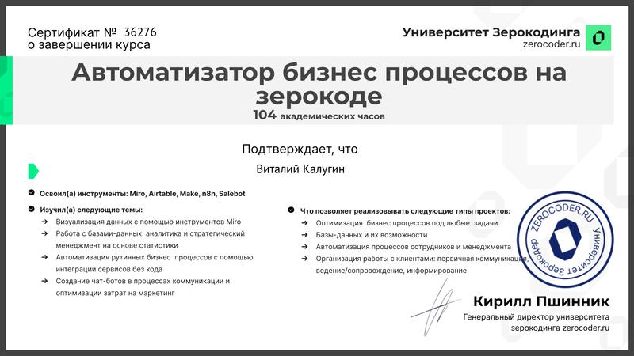
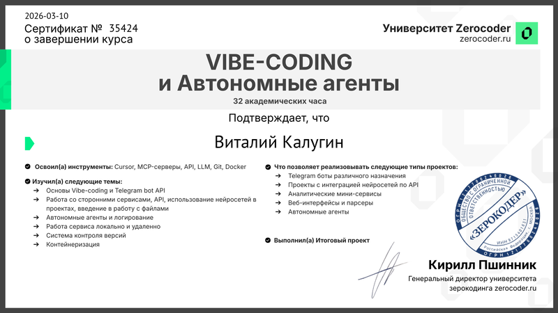
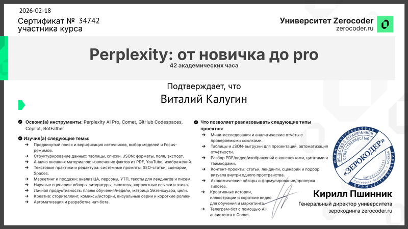
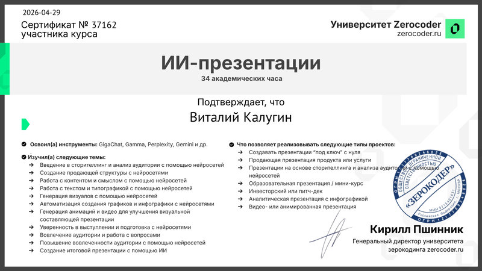
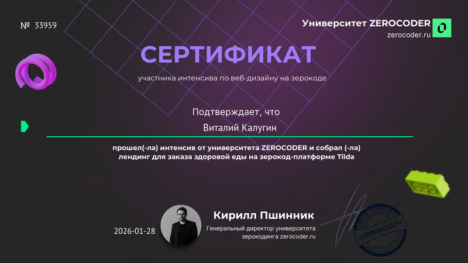

# Виталий Калугин

**Помогаю бизнесу принимать решения по данным и собирать рабочие ИИ-продукты** — от Telegram-ботов и автоматизаций n8n до прод-сайтов с расчётами и лидогенерацией.

**1 prod-сайт + 2 онлайн-демо** · **22+ кейсов по 5 направлениям** · **Docker-образы в GHCR** → [svorazbor.ru](https://svorazbor.ru)

**Сайт-визитка на Pages →** [`docs/PORTFOLIO_SITE.md`](./docs/PORTFOLIO_SITE.md) · **Запуск кейсов локально →** [`docs/RUN_LOCAL.md`](./docs/RUN_LOCAL.md) · **Образы GHCR →** [`docs/GHCR_IMAGES.md`](./docs/GHCR_IMAGES.md)

  
  
  
  
  
  
  
  
  
  
  

*Email для деловых запросов — по согласованию в Telegram.*

---

## Сертификаты и обучение

<b>Социальное доказательство:</b> курсы и программы (полный каталог с подписями — <a href="./Сертификаты/README.md"><strong>Сертификаты/README.md</strong></a>).

<table>
<tr>
<td align="center" width="25%">
   ИИ в таблицах
</td>
<td align="center" width="25%">
   Аналитик данных
</td>
<td align="center" width="25%">
   Автоматизация процессов
</td>
</tr>
<tr>
<td align="center">
   Vibe-Coding и агенты
</td>
<td align="center">
   Perplexity
</td>
<td align="center">
   ИИ-презентации
</td>
<td align="center">
   Лендинг
</td>
</tr>
<tr>
<td align="center">
   Автоматизация на n8n
</td>
<td></td>
<td></td>
<td></td>
</tr>
</table>

<a href="./Сертификаты/"><strong>Все файлы в папке Сертификаты →</strong></a>

---

## Живые сайты и демо

| Проект | Ссылка | Тип | Стек |
|--------|--------|-----|------|
| **Сайт-визитка (маркетинг)** | **[kaluginvit-svg.github.io/Portfolio/](https://kaluginvit-svg.github.io/Portfolio/)** | многостраничный Astro: услуги, кейсы, FAQ, CTA | Astro (статика) |
| **СВО — выплаты семьям** | **[svorazbor.ru](https://svorazbor.ru)** | прод-сайт + Telegram-бот, реальные лиды | Next.js + Telegram |
| **Dostaffkin — доставка** | **[kaluginvit72.github.io/dostaffkin](https://kaluginvit72.github.io/dostaffkin/)** | онлайн-демо фронта (backend локально) | Angular + Express + Postgres |
| **Superstore Dashboard** | **[kaluginvit-svg.github.io/Portfolio/superstore/](https://kaluginvit-svg.github.io/Portfolio/superstore/)** | интерактивный HTML-дашборд (после деплоя Pages) | Plotly + HTML |

Все четыре открываются по клику без локальной установки (кроме backend у Dostaffkin). Подробнее — в таблицах ниже и в [`docs/PORTFOLIO_SITE.md`](./docs/PORTFOLIO_SITE.md).

---

## Услуги и форматы работы

| Пакет | Что внутри | Срок | Артефакты в репо |
|-------|------------|------|------------------|
| **Аналитика и решения** | EDA, дашборды, A/B-тесты, юнит-экономика, отчёты для решений | 1–3 нед | [`01-data-analytics/`](./01-data-analytics/) |
| **Автоматизация процессов** | n8n, интеграции (Tally / Supabase / Sheets / Drive), скрапинг | 1–2 нед на сценарий | [`02-automation/`](./02-automation/) |
| **ИИ-продукты** | Telegram-боты, MCP-серверы, RAG, агенты на OpenAI/Anthropic | 2–4 нед | [`03-ai-products/`](./03-ai-products/) |
| **Веб-MVP** | Next.js / Angular + Express/Node + Postgres, деплой и домен | 2–4 нед | [`04-web/`](./04-web/) |
| **ИИ-консалтинг и стратегия** | Аудит процесса, дорожная карта внедрения ИИ, обучение команды | 1 встреча → план | [`05-ai-consulting/`](./05-ai-consulting/) |

**Связаться:** [Telegram @kaluginvit](https://t.me/kaluginvit) — обсудим задачу за 1–2 дня. Email — по запросу в личке.

> **Что прислать в Telegram, чтобы быстро дать оценку:** 1) цель и что считается успехом; 2) дедлайн или окно по срокам; 3) ссылка / контекст / пример данных. Этого хватит, чтобы предложить формат и оценить объём.

---

## Избранный кейс: калькулятор выплат для семей участников СВО (продакшен)

Один продукт в двух артефактах: **сайт** [svorazbor.ru](https://svorazbor.ru) (Next.js, квиз, лид-форма) и **Telegram-бот** (анкета, расчёт, заявки). На проде, реальный трафик из органики.

- Веб → [`04-web/svo-payouts-website`](./04-web/svo-payouts-website/)
- Бот → [`03-ai-products/svo-payments-bot`](./03-ai-products/svo-payments-bot/) · [GHCR-образ](https://github.com/kaluginvit-svg/Portfolio/pkgs/container/svo-payments-bot)

---

## Направления и флагманы

### [01 — Аналитика данных](./01-data-analytics/)

| Кейс | Результат / роль | Ссылка | Live |
|------|------------------|--------|------|
| A/B-тест в финтех | Полный отчёт по A/B с MDE и продуктовой рекомендацией — уровень product-аналитика | [`fintech-ab-test-credit-offer`](./01-data-analytics/fintech-ab-test-credit-offer/) | [nbviewer](https://nbviewer.org/github/kaluginvit-svg/Portfolio/blob/main/01-data-analytics/fintech-ab-test-credit-offer/notebooks/ab_test_analysis_showcase.ipynb) |
| Retail-аналитика и дашборд | Интерактивный дашборд + 3 инсайта для стейкхолдеров | [`superstore-retail-analytics`](./01-data-analytics/superstore-retail-analytics/) | [GitHub Pages `/superstore/`](https://kaluginvit-svg.github.io/Portfolio/superstore/) |
| Коммерческий анализ Wildberries | Реальный кейс продавца: где теряем маржу, что менять | [`wb-sales-commercial-analysis`](./01-data-analytics/wb-sales-commercial-analysis/) | локально / скрипты |

### [02 — Автоматизация](./02-automation/)

| Кейс | Результат / роль | Ссылка | Live |
|------|------------------|--------|------|
| Лидогенерация на n8n | **11 связанных workflow** для воронки B2B: интент → обогащение → касание → отчётность | [`leadgen-n8n-system`](./02-automation/leadgen-n8n-system/) | `docker compose` в проекте |
| Яндекс.Диск ↔ Google Drive | Двусторонний sync с конфликтами и cron-расписанием | [`yandex-google-sync`](./02-automation/yandex-google-sync/) | [GHCR](https://github.com/kaluginvit-svg/Portfolio/pkgs/container/yandex-google-sync) |
| Бронирования Tally → Supabase → почта | Полный flow «форма → дедуп → бронь → письма» без ручного Excel | [`hotel-booking-tally-supabase`](./02-automation/hotel-booking-tally-supabase/) | документация + workflow JSON |
| CI/CD-шаблон | GitHub Actions → GHCR → SSH-deploy: типовой деплой одной строкой | [`github-actions-setup`](./02-automation/github-actions-setup/) | [GHCR](https://github.com/kaluginvit-svg/Portfolio/pkgs/container/github-actions-setup) |
| Google Sheets — учебный отчёт | Сервисный аккаунт, форматирование листа, GUI-симулятор | [`google-sheets-report`](./02-automation/google-sheets-report/) | локально / Python |

### [03 — ИИ-продукты](./03-ai-products/)

| Кейс | Результат / роль | Ссылка | Live |
|------|------------------|--------|------|
| Telegram-бот выплат (парный с сайтом СВО) | **Бот на проде**, парный с [svorazbor.ru](https://svorazbor.ru) | [`svo-payments-bot`](./03-ai-products/svo-payments-bot/) | прод в Telegram · [GHCR](https://github.com/kaluginvit-svg/Portfolio/pkgs/container/svo-payments-bot) |
| MCP + Yandex Wordstat | MCP-сервер: семантика и частотности прямо в Cursor / Claude | [`seo-mcp-bot`](./03-ai-products/seo-mcp-bot/) | [GHCR `yandex-wordstat-mcp`](https://github.com/kaluginvit-svg/Portfolio/pkgs/container/yandex-wordstat-mcp) |
| Команда в чате: Haystack + Pinecone | Корпоративный RAG-бот с памятью команды | [`team-ai-bot`](./03-ai-products/team-ai-bot/) | [GHCR](https://github.com/kaluginvit-svg/Portfolio/pkgs/container/team-ai-bot) |
| Персональный RAG в Telegram | RAG-ассистент по личной базе знаний (Pinecone) | [`personal-rag-assistant`](./03-ai-products/personal-rag-assistant/) | [GHCR](https://github.com/kaluginvit-svg/Portfolio/pkgs/container/personal-rag-assistant) |
| ИИ-агент сбора SEO-ядра по списку URL | Автоматический парсинг + кластеризация запросов через ProxyAPI | [`autonomous-agents`](./03-ai-products/autonomous-agents/) | [GHCR backend](https://github.com/kaluginvit-svg/Portfolio/pkgs/container/autonomous-agents-backend) |
| End-to-end MCP: каталог-БД ↔ Telegram-бот | Рабочий шаблон «LLM ↔ MCP ↔ SQLite» под любой каталог | [`mcp-lesson`](./03-ai-products/mcp-lesson/) | `docker compose` в проекте |

### [04 — Веб](./04-web/)

| Кейс | Результат / роль | Ссылка | Live |
|------|------------------|--------|------|
| Сайт СВО (прод) | **Прод-сайт** с квизом, лид-формой и Telegram-ботом-парой | [`svo-payouts-website`](./04-web/svo-payouts-website/) | [svorazbor.ru](https://svorazbor.ru) · [GHCR](https://github.com/kaluginvit-svg/Portfolio/pkgs/container/svo-payouts-website) |
| Dostaffkin: Angular + Express, доставка | Full-stack минимализм с трекингом статусов; **демо онлайн** | [`dostaffkin`](./04-web/dostaffkin/) | **[Сайт](https://kaluginvit72.github.io/dostaffkin/)** · `docker compose` · [GHCR backend](https://github.com/kaluginvit-svg/Portfolio/pkgs/container/dostaffkin-backend) |
| Telegram-бот ↔ PostgreSQL | Каркас «бот ↔ Postgres ↔ бэкап» под анкеты, лиды, заявки | [`postgres-work`](./04-web/postgres-work/) | `docker compose` + бот локально |
| Мини-CRM (учебная) | FastAPI + React, OAuth Google, выгрузка в Sheets | [`mini-crm-fastapi-react`](./04-web/mini-crm-fastapi-react/) | `docker compose` + `npm run dev` |

### [05 — ИИ-консалтинг](./05-ai-consulting/)

| Кейс | Результат / роль | Ссылка | Live |
|------|------------------|--------|------|
| Стратегия ИИ в бухгалтерии | Готовая презентация и дорожная карта для пилота в финансовой команде | [`ai-in-accounting-strategic-plan`](./05-ai-consulting/ai-in-accounting-strategic-plan/) | [PDF](./05-ai-consulting/ai-in-accounting-strategic-plan/presentation.pdf) · [cover](./05-ai-consulting/ai-in-accounting-strategic-plan/media/cover.png) |

### Стек по флагманам (кратко)

| Направление | Типовой стек |
|-------------|----------------|
| 01 Аналитика | Python, pandas, Jupyter, HTML/Plotly |
| 02 Автоматизация | Python/Flask/Express, n8n, Postgres, Docker |
| 03 ИИ-продукты | Telegram, OpenAI/MCP, Docker, GHCR |
| 04 Веб | Next.js, Angular, Node, Postgres |
| 05 Консалтинг | Markdown, PDF, презентации |

---

<strong>Архив — учебные артефакты и эксперименты</strong>

Папка [`99-archive/`](./99-archive/) — уроки, черновики и мини-проекты для истории; на «витрине» они не конкурируют с основными кейсами выше.

---

## Полный индекс папок

Краткие оглавления по направлениям: [`01-data-analytics/README.md`](./01-data-analytics/README.md), [`02-automation/README.md`](./02-automation/README.md), [`03-ai-products/README.md`](./03-ai-products/README.md), [`04-web/README.md`](./04-web/README.md), [`05-ai-consulting/README.md`](./05-ai-consulting/README.md) · **сертификаты:** [`Сертификаты/README.md`](./Сертификаты/README.md).

Базовый URL на GitHub: `https://github.com/kaluginvit-svg/Portfolio/tree/main/`

---

## Обсудить задачу

Напишите в [Telegram @kaluginvit](https://t.me/kaluginvit) — обсудим аналитику, автоматизацию, ИИ-продукт или внедрение ИИ в процесс. Ответ — в течение рабочего дня.

**Чтобы быстро дать оценку, пришлите:**

1. Цель и что считается успехом.
2. Дедлайн или окно по срокам.
3. Контекст / пример данных / ссылку на текущее решение.

Этого хватит, чтобы предложить формат работы и согласовать объём.
