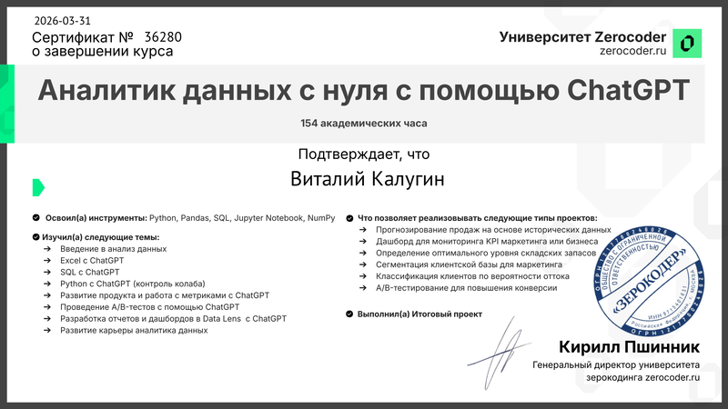
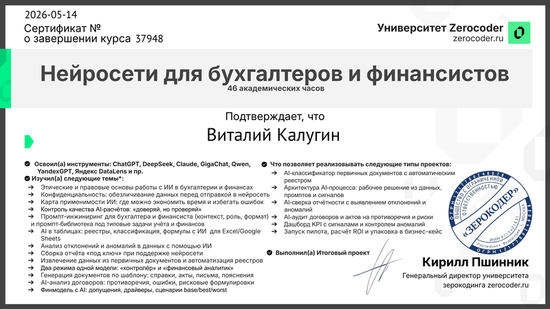
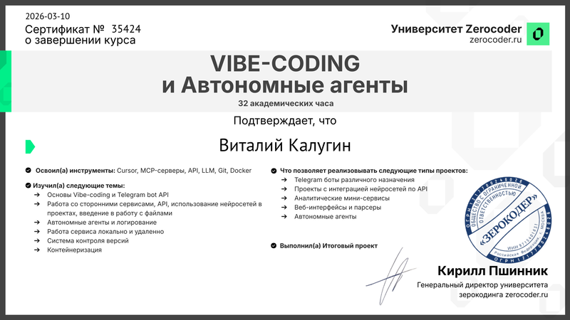
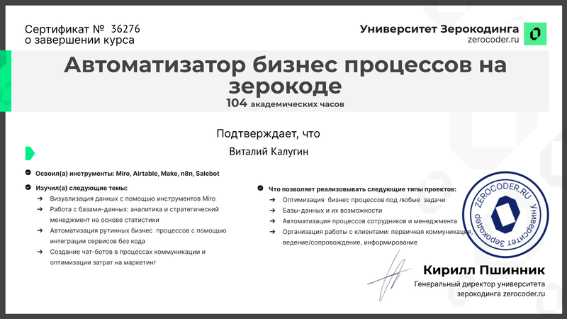
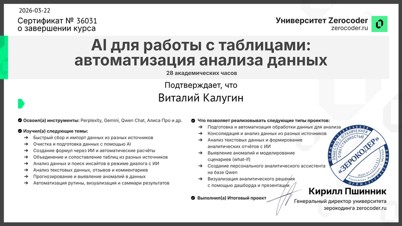
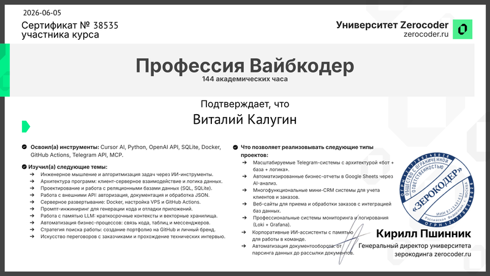
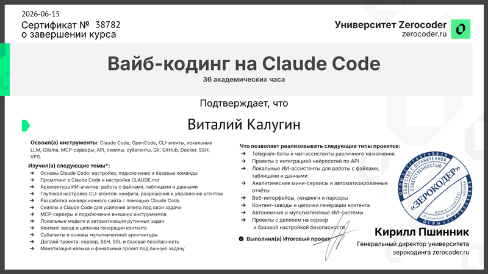
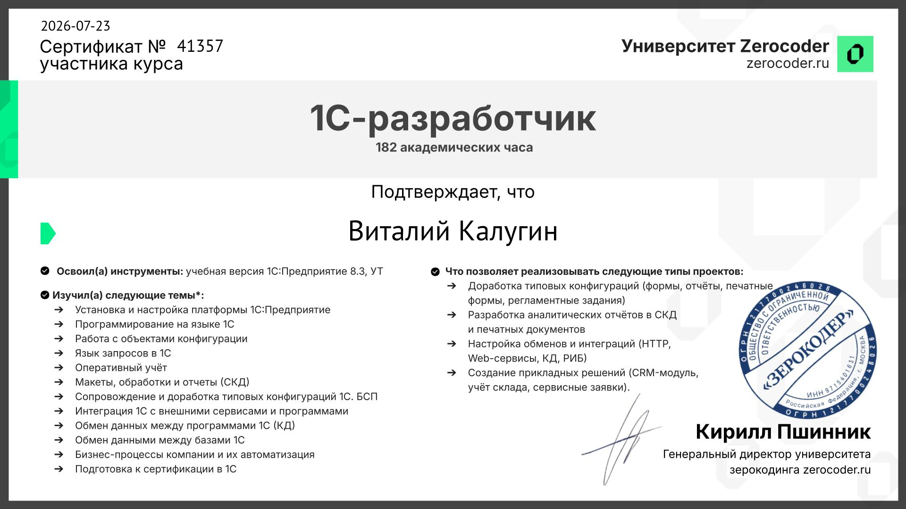

<div align="center">

# Виталий Калугин

**Corporate Finance × Software Development × AI × Automation**

Финансовый консультант и прикладной разработчик.  
Строю рабочие инструменты для финансов, аналитики и бизнес-процессов:  
от Python/API и AI-агентов до web-приложений, Telegram-ботов и автоматизации.

**1 live production сайт · 2 production-бота · 7 core showcase · 5 supporting projects**

[](https://svorazbor.ru)
[](https://t.me/kaluginvit)

<p>
  
  
  
  
  
  
  
  
  
</p>

</div>

---

## Что умею делать

Когда есть бизнес-задача — понять её, разобраться в предметной области, выбрать архитектуру и реализовать рабочий инструмент. Без разрыва между «что нужно бизнесу» и «что написать в коде».

**Финансовая экспертиза:** P&L, Cash Flow, NPV/IRR, unit economics, оценка активов, A/B метрики в fintech  
**Разработка:** Python · FastAPI · SQL · React/Next.js · Telegram · n8n · LLM/AI · Docker · CI/CD

---

## Core Showcase

### Финансовые системы

---

#### Finance MCP Server — Финансовый ИИ-слой для Claude Desktop / Cursor

**Задача:** финансист хочет задавать вопросы по своим данным прямо из AI-ассистента — без экспорта CSV, без промежуточных скриптов.

*«Какая EBITDA за Q3?» «Какие договоры истекают?» «Посчитай NPV по проекту 2»* — ответ из локальной БД за секунды.

**Role:** Architect · Developer · Financial Domain Expert  
**Stack:** Python · MCP Protocol · SQLite · pytest · Next.js UI

**Highlights:**
- 19 инструментов: P&L, Cash Flow, Balance Sheet, budget vs fact, liquidity forecast, payment calendar, contract risk scan, NPV/IRR/PI
- Данные остаются на машине — SQLite, zero-deploy
- Seed data: 2 компании, 12 месяцев финансовой истории
- Тесты: KPI, ликвидность, договоры, инвестиционная оценка, негативные кейсы

→ [`03-ai-products/finance-mcp-server`](./03-ai-products/finance-mcp-server/)

---

#### AI Financial Data Screener — MOEX и ЦБ РФ через текстовый запрос

**Задача:** аналитик хочет получить данные по акциям MOEX или курсам ЦБ без знания API — просто написать запрос по-русски.

**Role:** Architect · Developer  
**Stack:** FastAPI · PostgreSQL · Alembic · React TypeScript · Tailwind · Recharts · GPT-4o-mini + instructor · Docker

**Highlights:**
- 3 источника: MOEX ISS API, ЦБ РФ, ТАСС RSS
- LLM-планировщик строит план сбора, при неоднозначности — показывает причину и блокирует
- Полный audit log каждого запроса
- `docker compose up --build` → готово

→ [`04-web/finance-data-screener`](./04-web/finance-data-screener/) · [Live Demo](https://kaluginvit.github.io/Portfolio/finance-data-screener/)

---

#### Fedresurs MVP — Оценка лотов банкротства

**Задача:** покупатель лотов тратит 30-60 мин на поиск рыночных аналогов вручную — для портфеля из 20-50 активов это неподъёмно.

**Role:** Architect · Developer · Financial Domain Expert  
**Stack:** Python · SQLite · Flask · Gemini/OpenRouter · Tavily/Brave

**Highlights:**
- Два движка: статистический (P25/P50/P75 по аналогам) и LLM-агент с web-поиском
- 4 сценария цены: auction_price / lot_buyer / wholesale / retail — стандарт профессионального оценщика
- Работает с любым типом актива: квартира, оборудование, транспорт, дебиторка
- 47 тестов на бизнес-логику оценки

→ [`01-data-analytics/fedresurs-mvp`](./01-data-analytics/fedresurs-mvp/) · [Live Demo](https://kaluginvit.github.io/Portfolio/fedresurs-mvp/)

---

### Аналитика и данные

---

#### A/B-тест: Кредитка дня в финтех-приложении

**Задача:** продуктовая команда проверяет гипотезу — поднять карточку выше в ленте. Нужен методологически корректный анализ с рекомендацией.

**Role:** Product Analyst · Data Scientist  
**Stack:** Python · scipy · pandas · SQL · Jupyter · Makefile · Docker

**Highlights:**
- User-level Welch t-test: почему именно он, а не Mann-Whitney
- MDE analysis и расчёт требуемого размера выборки
- SQL pipeline (window functions, user-level funnel)
- Честная интерпретация: directional signal vs окончательный rollout
- `make all` — полный воспроизводимый pipeline без внешних зависимостей

→ [`01-data-analytics/fintech-ab-test-credit-offer`](./01-data-analytics/fintech-ab-test-credit-offer/)  
[Live Demo](https://kaluginvit.github.io/Portfolio/fintech-ab-test/)

---

### AI-инструменты

---

#### HR-Breaker — Оптимизация резюме с anti-hallucination pipeline

**Задача:** адаптировать резюме под конкретную вакансию, не придумывая опыт которого нет.

**Role:** Architect · Developer  
**Stack:** Python · Pydantic-AI · FastAPI · LiteLLM · WeasyPrint · Click · Alpine.js · uv

**Highlights:**
- Любой формат на входе (PDF, DOCX, Markdown, text) → ATS-friendly PDF на выходе
- 8-уровневый фильтр: Content Length → Hallucination Checker → TF-IDF → LLM ATS → Vector Similarity → Translation Quality
- Web UI + CLI, SSE streaming прогресса в реальном времени
- 30+ тестов, multi-LLM (LiteLLM: Gemini, OpenAI, Anthropic)

→ [`03-ai-products/hr-breaker`](./03-ai-products/hr-breaker/) · [Live Demo](https://kaluginvit.github.io/Portfolio/hr-breaker/)

---

### Автоматизация

---

#### Leadgen n8n System — 11 workflow B2B лидогенерации

**Задача:** в B2B-воронке нужно не просто "слать письма", а последовательно обогащать лида, согласовывать ответы LLM и держать контроль человека над ключевыми решениями.

**Role:** Architect · Developer  
**Stack:** n8n · JSON workflow exports · Docker Compose (n8n + PostgreSQL)

**Highlights:**
- Intent Radar → Deep Enrichment → Multi-LLM Consensus → Human-in-the-Loop → Premium Outreach → Smart Nurture → Competitive Intel → Live Dashboard
- Shadow validation mode перед production запуском
- Единый Global Error Handler для всей системы
- `docker compose up` → UI n8n на :5678 → импорт 11 workflow

→ [`02-automation/leadgen-n8n-system`](./02-automation/leadgen-n8n-system/) · [Live Demo](https://kaluginvit.github.io/Portfolio/leadgen-n8n-system/)

---

### Web-приложения и production

---

#### SVO — Web + Telegram + CI/CD (end-to-end production кейс)

**Задача:** семьи погибших участников СВО часто не понимают, какие выплаты существуют и куда обращаться. Нужен доступный инструмент с понятными ориентирами и возможностью оставить заявку.

**Решение:** один продукт в двух точках доступа — сайт и Telegram-бот. Одна логика, разные интерфейсы.

**Role:** Architect · Developer · Product Owner

**Web (Next.js):** квиз → расчёт → лид-форма → webhook в CRM  
**Stack:** Next.js 14 · TypeScript · Tailwind · Playwright E2E · Docker · nginx · GitHub Actions → VPS  
→ [`04-web/svo-payouts-website`](./04-web/svo-payouts-website/) · **Live: [svorazbor.ru](https://svorazbor.ru)**

**Bot (aiogram 3):** тот же сценарий в Telegram, FSM с persisted state  
**Stack:** Python · aiogram 3 · aiosqlite · Docker · GitHub Actions → GHCR → SSH deploy  
→ [`03-ai-products/svo-payments-bot`](./03-ai-products/svo-payments-bot/)

**Highlights:**
- Production с реальным трафиком
- E2E тесты (Playwright): fresh-flow, lead-form, quiz-navigation, stuck-flow
- После перезапуска бота незавершённый квиз продолжается с того же шага (FSM persistence)
- Full CI/CD: code push → Docker build → GHCR publish → SSH deploy на VPS

---

#### Mini CRM — FastAPI + React + Google Sheets

**Задача:** внутренний инструмент для ведения клиентов и сделок с выгрузкой отчётов в Google Sheets.

**Role:** Full-stack Developer  
**Stack:** FastAPI · SQLite · React TypeScript · Google Drive/Sheets OAuth · Docker

**Highlights:**
- Кнопка «Выгрузить отчёт» → новая Google Таблица с данными и ссылкой
- OAuth 2.0 flow для Google API
- SECURITY.md: полная документация по работе с секретами
- `docker compose up --build` → backend готов

→ [`04-web/mini-crm-fastapi-react`](./04-web/mini-crm-fastapi-react/) · [Live Demo](https://kaluginvit.github.io/Portfolio/mini-crm-fastapi-react/)

---

## More Projects

| Проект | Стек | Что показывает |
|--------|------|----------------|
| [RF Macro Risk AI](./03-ai-products/rf-macro-risk-ai/) | LangChain · LangGraph · GitHub Pages | 35 макро-критериев → risk score · [Live Demo](https://kaluginvit.github.io/rf-macro-risk-ai) |
| [Superstore Analytics](./01-data-analytics/superstore-retail-analytics/) | Python · Plotly · Docker | EDA + интерактивный HTML-дашборд · [Live Demo](https://kaluginvit.github.io/Portfolio/superstore/) |
| [Hotel Booking n8n](./02-automation/hotel-booking-n8n/) | n8n · Supabase · HTML | Автоматизация бронирования: форма → бронь → email |
| [Team AI Bot](./03-ai-products/team-ai-bot/) | Python · Pinecone · aiogram · Docker | Корпоративный RAG по истории чата команды |

---

## Стек

| | |
|-|-|
| **Backend** | Python · FastAPI · aiogram 3 · SQLAlchemy · Alembic · Flask |
| **Frontend** | React TypeScript · Next.js 14 · Tailwind · Vite · Recharts |
| **AI / LLM** | MCP · LangChain · LangGraph · Pydantic-AI · LiteLLM · RAG · Pinecone |
| **Automation** | n8n · GitHub Actions · Makefile · CI/CD |
| **Data** | PostgreSQL · SQLite · pandas · scipy · Jupyter · SQL |
| **Infra** | Docker · Docker Compose · nginx · VPS · GHCR |

---

## Сертификаты

<table>
<tr>
<td align="center"><a href="./Сертификаты/Аналитик_данных_рус.png"></a><br/><sub>Аналитик данных</sub></td>
<td align="center"><a href="./Сертификаты/Автоматизация_n8n_рус.png"></a><br/><sub>Автоматизация n8n</sub></td>
<td align="center"><a href="./Сертификаты/Нейросети_для_финансистов_рус.png"></a><br/><sub>Нейросети для финансистов</sub></td>
<td align="center"><a href="./Сертификаты/Vibe-Coding_и_агенты_рус.png"></a><br/><sub>Vibe-Coding и агенты</sub></td>
</tr>
<tr>
<td align="center"><a href="./Сертификаты/Автоматизатор_бизнес-процессов_рус.png"></a><br/><sub>Автоматизация процессов</sub></td>
<td align="center"><a href="./Сертификаты/AI_в_таблицах_рус.png"></a><br/><sub>ИИ в таблицах</sub></td>
<td align="center"><a href="./Сертификаты/Профессия_Вайбкодер_рус.png"></a><br/><sub>Профессия Вайбкодер</sub></td>
<td align="center"><a href="./Сертификаты/Вайб-кодинг_на_ClaudeCode_рус.png"></a><br/><sub>Вайб-кодинг на Claude Code</sub></td>
</tr>
<tr>
<td align="center"><a href="./Сертификаты/1С-разработчик_рус.png"></a><br/><sub>1С-разработчик</sub></td>
<td align="center"><a href="./Сертификаты/Вайб-кодинг_на_ClaudeCode_рус.png"></a><br/><sub>Вайб-кодинг на Claude Code</sub></td>
<td></td>
<td></td>
</tr>
</table>

→ [Все сертификаты](./Сертификаты/README.md)

---

## Структура

```
Portfolio/
├── 01-data-analytics/    # EDA, A/B tests, financial analysis
├── 02-automation/        # n8n workflows, scrapers, integrations
├── 03-ai-products/       # Telegram bots, MCP, RAG, AI tools
├── 04-web/               # Full-stack web apps, production sites
└── site/                 # Portfolio website (Astro)
```

---

## Контакт

[Telegram @kaluginvit](https://t.me/kaluginvit) — для обсуждения задач.
